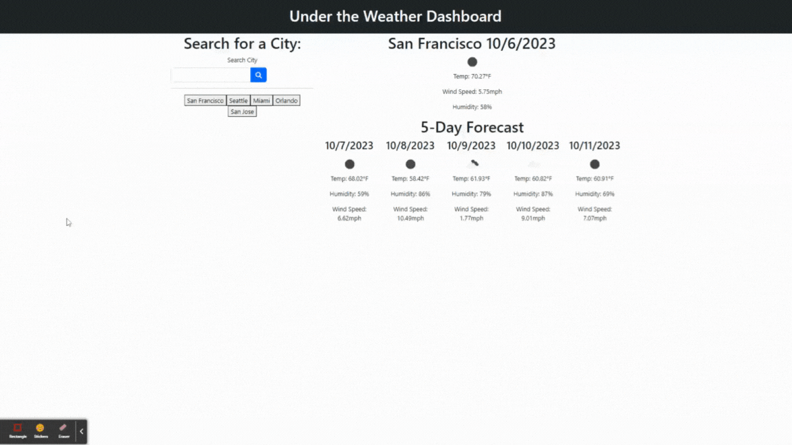

# 06 Server-Side APIs: Weather Dashboard

## Your Task

Our task is to build a 5 Day Weather Forecast that took weather data from different cities by using [Weather Forecast](https://openweathermap.org/forecast5). We utilized longitude and latitude to retrieve the coordinates of the city name and used localStorage to store persistent data.

## User Story

```
AS A traveler
I WANT to see the weather outlook for multiple cities
SO THAT I can plan a trip accordingly
```

## Acceptance Criteria

```
GIVEN a weather dashboard with form inputs
WHEN I search for a city
THEN I am presented with current and future conditions for that city and that city is added to the search history
WHEN I view current weather conditions for that city
THEN I am presented with the city name, the date, an icon representation of weather conditions, the temperature, the humidity, and the wind speed
WHEN I view future weather conditions for that city
THEN I am presented with a 5-day forecast that displays the date, an icon representation of weather conditions, the temperature, the wind speed, and the humidity
WHEN I click on a city in the search history
THEN I am again presented with current and future conditions for that city
```

## Mock-Up

The following gif shows the web application's appearance and functionality: 


### Repository Quality: 13%

* Quality comments, etc.

* Repository contains multiple descriptive commit messages.

© 2023 edX Boot Camps LLC. Confidential and Proprietary. All Rights Reserved.
# undertheweather
